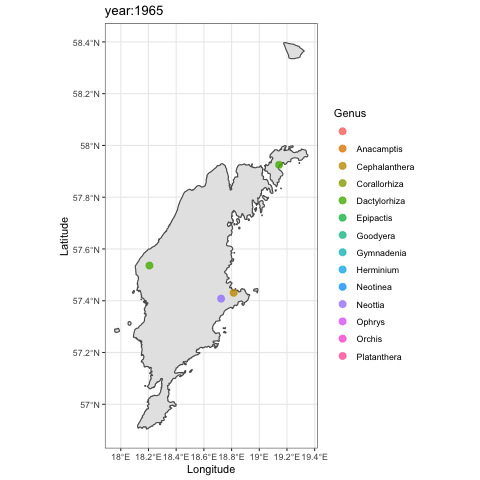

```{r setup, include=FALSE}
knitr::opts_chunk$set(echo = FALSE)

library(dplyr)
library(gganimate)
library(oRchid)
library(knitr)
```


## All the orchids

``` {r echo = T, message = F, warning = F}
dat <- orchids
orchidsmap(dat, "long", "lat", "genus")

```

## Some of the orchids

``` {r echo = T, message = F, warning = F}
dat <- orchids
dat %>% 
  filter(year > 2010) %>% 
  orchidsmap("long", "lat", "genus")

```


## All of the orchids

```{r eval=F, echo=T}
#dat %>% 
  #filter(year > 2010) %>% 
  #orchidsmap("long", "lat", "genus")
  #transition_states(year, transition_length = 3, state_length = 1) +
  #labs(title = "year:{closest_state}")

```

## All of the orchids

``` {r}


```


## Orchids in rain

`flowerp(2015)`

``` {r }
knitr::include_graphics("rain.tif")
```


