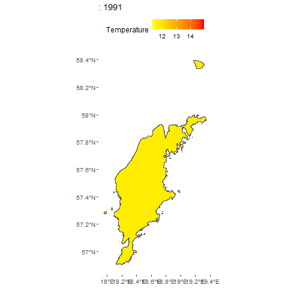

```{r setup, include=FALSE}
knitr::opts_chunk$set(echo = TRUE)
library(ggplot2)
library(ggpubr)
library(tidyverse)
library(data.table)
library(gganimate)
library(sf)
```


## oRchid package - the most gotlandic R package *perhaps* ever made
`devtools::install_github("karenlykkebo/oRchid")

## Annual summer temperatures on Gotland as a wrap

`dat_temp<-oRchid::temp_got
oRchid::gtempWrap(dat_temp,"avgyear","year",2010)`

## Annual summer temperatures on Gotland as a wrap
```{r echo=F, fig.align="center", message=FALSE, warning=FALSE}
dat_temp<-oRchid::temp_got
oRchid::gtempWrap(dat_temp,"avgyear","year",1990)+
  facet_wrap(~year,ncol=10,nrow=3)+theme(axis.text = element_blank(),axis.ticks = element_blank(),legend.position = "right")

```

## Annual summer temperatures as a gif - why not

`oRchid::gtemp_anim(dat_temp,"avgyear","year",1990)`

## Annual summer temperatures as a gif - why not
```{r echo=FALSE, fig.align="center", message=FALSE, warning=FALSE, out.width="50%"}


```


## Was it easy?

## Was it easy? 

**No.** But ioslides was worse.

At least it is not pretty.

